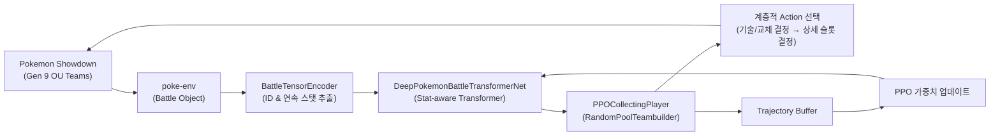
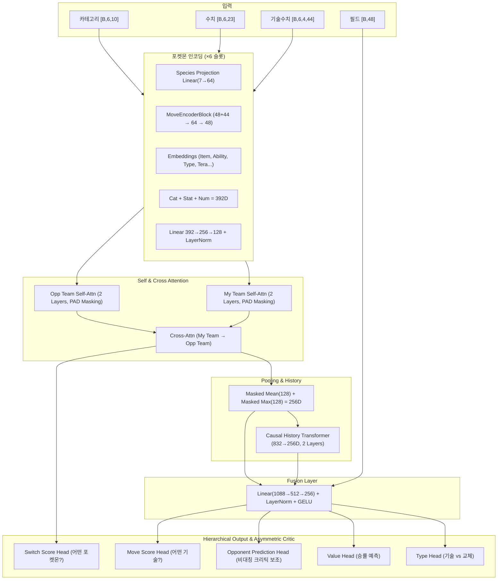

# 🧠 Poke-AI 강화학습 아키텍처 전체 정리 (v2.1 - 최신 업데이트 반영)

> 최근 **크로스 어텐션(Cross-Attention)**, **계층적 행동 공간(Hierarchical Action Space)**, **비대칭 크리틱(Asymmetric Critic)**에 더해, **인과적 트랜스포머 기반 히스토리(Causal History Transformer)** 및 **초정밀 기술 수치 임베딩**이 도입된 최신 아키텍처 구조입니다.

## 전체 파이프라인 개요

---

## 1. 상태 인코딩 (State Encoding)

배틀 상태를 **5종류의 텐서**로 변환합니다.

### 1.1 카테고리 텐서 — `my_cat` / `opp_cat` : `[B, 6, 10]`

6마리 포켓몬 × 10개 카테고리 ID (정수형, Embedding 입력). **(Species ID 룩업 제거됨)**

| Index | 의미 | 비고 |
|:-----:|:-----|:-----|
| 0 | 도구 (Item) | 0 = 미공개 |
| 1 | 특성 (Ability) | 0 = 미공개 |
| 2 | 타입 1 | |
| 3 | 타입 2 | 0 = 단일 타입 |
| 4 | 상태이상 | 0 = 없음 |
| 5~8 | 기술 1~4 ID | 0 = 미공개 |
| **9** | **테라 타입 (Tera Type)** | **새로 추가된 피처** |

### 1.2 수치 텐서 — `my_num` / `opp_num` : `[B, 6, 23]`

기존 배틀 스탯 + 포켓몬 종족값(Base Stats) 피처에 더해 **추론 플래그(4차원)**가 추가되었습니다.

> **💡 하이브리드 도구 인코딩 (Hybrid Item Encoding)**
> 구애안경, 생명의구슬, 부스트에너지 등 **수치(스탯)에 직접적인 영향을 주는 도구**들의 효과가 **13~17번 스탯 텐서에 직접 곱해져서(Pre-calculated) 반영**됩니다.

| Index | 의미 | 범위 |
|:-----:|:-----|:-----|
| 0 | 필드 위 여부 | 0.0 / 1.0 |
| 1 | 기절 여부 | 0.0 / 1.0 |
| 2 | 현재 HP 비율 | 0.0 ~ 1.0 |
| 3~7 | 공/방/특공/특방/스피드 랭크 | ÷ 6.0 |
| 8 | 레벨 | ÷ 100.0 |
| 9 | 기믹 활성 상태 | 다이맥스 턴/3, 테라=1.0, 메가=1.0 |
| 10 | 기믹 사용 가능 | 0.0 / 1.0 (상대팀은 항상 0) |
| 11 | 포지션 슬롯 (제거 예정/미사용) | - |
| 12 | 종족값 HP | ÷ 255.0 (0.0이면 빈 슬롯 마스킹) |
| 13~17 | 종족값 공/방/특공/특방/스피드 | 도구 배율 적용 후 ÷ 255.0 |
| 18 | 몸무게 (Weight) | ÷ 500.0 |
| **19~22** | **추론 플래그 (Inference Flags)** | **새로 추가된 피처** |

> **🔥 핵심 변경 사항: 포지셔널 인코딩 제거 & Set 기반 처리**
> 과거 벤치 멤버의 순서(1~5번 슬롯)에 고유한 위치 임베딩(PositionalSlotEncoding)을 부여했던 방식을 제거했습니다. 이제 벤치 멤버들은 **순열 불변성(Permutation Invariance)**을 갖는 순수한 집합(Set)으로 처리되어 훈련 안정성이 극대화되었습니다. (빈 슬롯은 HP=0.0을 기준으로 완벽하게 마스킹됨)

### 1.3 기술 수치 텐서 — `my_m_num` / `opp_m_num` : `[B, 6, 4, 44]`
기존 7차원(위력, 명중률 등)에 불과했던 기술 정보가 **44차원**으로 대폭 확장되었습니다!
| Index | 의미 |
|:-----:|:-----|
| 0~6 | 위력, 명중률, PP비율, 우선도, 물리/특수/변화 분류, 부가효과(구), 기술타입 |
| 7 | 상대 액티브 포켓몬에 대한 실제 타입 상성 배율 |
| **8~43** | **36차원의 부가효과 멀티-핫 벡터 (MOVE_EFFECT_NAMES)** |

### 1.4 필드 텐서 — `field_vec` : `[B, 48]`
날씨, 트릭룸, 필드, 벽, 스텔스록, 턴 수 등의 통합 벡터.

---

## 2. 신경망 아키텍처 (Neural Network)

### 🏆 주요 아키텍처 혁신 (최신 업데이트 반영)

1. **GRU 걷어내고 인과적 트랜스포머(Causal Transformer)로 교체**
   과거의 GRUCell 병목을 제거하고, 최대 256턴까지의 과거 배틀 요약 정보를 **Causal Transformer(2 Layers)**로 완벽하게 스캔합니다. 이를 통해 훨씬 더 긴 맥락을 기억하고 치밀한 장기 심리전을 설계할 수 있습니다.
2. **기술 수치 차원 대폭 확장 (7D → 44D)**
   단순한 위력/명중률을 넘어, 36종류의 세밀한 부가효과(풀죽음, 마비, 스탯 하락 등)와 실제 타겟 상성 배율까지 인코딩하여 모델이 복잡한 기술의 진정한 가치를 판단할 수 있게 되었습니다. `MoveEncoderBlock`에서 GELU를 거쳐 강력한 피처로 결합됩니다.
3. **완벽한 Set 마스킹 (Empty Slot Masking)**
   종족값 HP가 0인 슬롯(미배정 슬롯)을 Self-Attention 및 Cross-Attention 단계에서 원천적으로 마스킹(`src_key_padding_mask`)하여 패딩 노이즈를 완전히 제거했습니다.
4. **호기심(Entropy) 파라미터 충격 요법**
   휴리스틱 봇과의 고착 상태(무한 교체 Deadlock)를 깨기 위해 PPO 업데이트의 `entropy_coef`를 일시적으로 대폭 끌어올려 강제로 다른 전략을 탐험하도록 훈련 코드 단위에서 조치가 취해졌습니다.

---

## 3. 학습 파이프라인 및 전략

### 3.1 호환성 로더 (Backward Compatible Loader)
- 새롭게 추가된 피처(테라 타입, 44D 기술 수치, 추론 플래그 등)를 수용하기 위해, 입력 열이 확장된 Linear 레이어의 가중치 뒷부분을 `0`으로 초기화하여 로드합니다. 이를 통해 훈련 초반에는 과거 가중치의 정책을 보존하고, 점진적으로 새 피처를 활용하도록 유도합니다.

### 3.2 조기 종료(Early Stopping) 메커니즘
- PPO 업데이트 중 **KL Divergence**가 목표치(0.0225)를 초과하면 해당 Iteration의 남은 Epoch 업데이트를 즉시 중단(Skip)하여 정책이 붕괴되는 것을 방지합니다.
